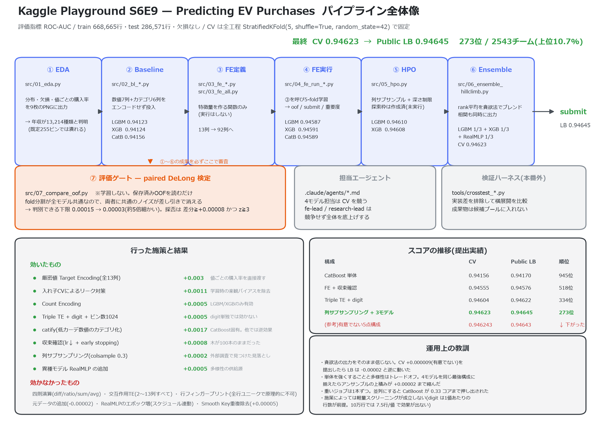

# Kaggle Playground Series S6E9 — Predicting Electric Vehicle Purchases

EV(電気自動車)を購入するか(`Will_Buy_EV`: Yes/No)を予測する二値分類コンペ。評価指標は **ROC-AUC**。

- コンペ: https://www.kaggle.com/competitions/playground-series-s6e9
- **最良スコア: CV 0.94623 / Public LB 0.94645 — 273位 / 2543チーム(上位10.7%)**
- 目標(上位15%)は達成済み。1位は 0.94675、締切は 2026-09-30
- 方針・ルール: [CLAUDE.md](CLAUDE.md)
- 詳細な実験ログ・外部調査の記録はローカルで管理(公開リポジトリには含めていません)

## プロセス全体像



```
① EDA → ② Baseline → ③ FE定義 → ④ FE実行 → ⑤ HPO → ⑥ Ensemble → submit
                                      ↓                    ↓
                          Agents(担当制)          ⑦ 評価(DeLong検定)
```

**ファイル名の先頭の番号が工程の順番**。`src/` を上から読めば流れが追える。

| # | 工程 | ファイル | 出力 |
|---|---|---|---|
| ① | EDA | `src/01_eda.py` | `datacheck/*.png` |
| ② | Baseline | `src/02_bl_<model>.py` | `submit/submission_<model>.csv` |
| ③ | FE定義 | `src/03_fe_<model>.py` / `src/03_fe_all.py` | (関数のみ。実行しない) |
| ④ | FE実行 | `src/04_fe_run_<model>.py` | `oof/` `submit/` `importance/` |
| ⑤ | HPO | `src/05_hpo.py` | `hpo_results.csv` |
| ⑥ | Ensemble | `src/06_ensemble_hillclimb.py` | `submit/submission_hillclimb.csv` |
| ⑦ | 評価 | `src/07_compare_oof.py` | 採否判定(paired DeLong 検定) |
| — | Agents | `.claude/agents/*.md` | `docs/fe_results_*.md` |

---

## ① EDA

```bash
uv run src/01_eda.py
```

`data/` の CSV を読み込み、特徴量をグラフ化して `datacheck/` に保存する(ファイル名先頭の連番が表示順)。

| ファイル | 内容 |
|---|---|
| `01_target_distribution.png` | 目的変数の件数と比率 |
| `02_categorical_hist.png` | カテゴリ6列の分布(Yes/No積み上げ) |
| `03_numeric_hist.png` | 数値7列の分布 |
| `04_numeric_log_hist.png` | 高カーディナリティ2列の対数分布 |
| `05_correlation_heatmap.png` | 数値列と目的変数の相関 |
| `06_boxplots_by_target.png` | Yes/No別の箱ひげ図 |
| `07_target_rate_by_category.png` | カテゴリ値ごとの購入率 |
| `08_target_rate_by_numeric.png` | 数値の値ごとの購入率 |
| `09_train_test_distribution.png` | train と test の分布比較 |

**主な所見**: train 668,665行 / test 286,571行、欠損なし、購入率 17.5%。
`Environmental_Concern_Level` の効きが圧倒的(レベル1で約1% → レベル5で約52%)。
**年収は 13,214 種類の値**を持ち、木の既定ビン数(255)では値ごとの違いが潰れる
→ 後の厳密値 Target Encoding とビン数引き上げにつながる最重要の所見。

## ② Baseline

```bash
uv run src/02_bl_lgbm.py
uv run src/02_bl_xgb.py
uv run src/02_bl_catboost.py
```

数値7列 + カテゴリ6列をエンコーディングせず、各ライブラリのネイティブなカテゴリ対応に渡しただけの構成。
CV は全モデル共通で `StratifiedKFold(n_splits=5, shuffle=True, random_state=42)`。
**この分割を全モデルで揃えることが、後のアンサンブルと DeLong 検定の前提になる。**

| モデル | OOF AUC | Public LB |
|---|---|---|
| LightGBM | 0.94123 | 0.94093 |
| XGBoost | 0.94124 | 0.94152 |
| CatBoost | 0.94156 | 0.94170 |

## ③ FE定義 / ④ FE実行

各モデルごとに「FE関数の定義」と「実行スクリプト」を分けている。

| モデル | FE関数 | 実行スクリプト |
|---|---|---|
| LightGBM | `src/03_fe_lgbm.py` | `src/04_fe_run_lgbm.py` |
| XGBoost | `src/03_fe_xgb.py` | `src/04_fe_run_xgb.py` |
| CatBoost | `src/03_fe_catboost.py` | `src/04_fe_run_catboost.py` |
| RealMLP | `src/03_fe_realmlp.py` | `src/04_fe_run_realmlp.py` |
| (横断) | `src/03_fe_all.py`(全モデルのFEを集約したカタログ) | — |

**効いたもの**
- **厳密値 Target Encoding**(各モデル +0.003 前後、最大の改善要因)。数値列もビン分割せず値のままキーにする
- **入れ子 CV によるリーク対策**(+0.00108)。学習行には内側CVのOOF値を当てる
- Count Encoding(LightGBM/XGBoost のみ。CatBoost では無効)
- Triple TE + Smooth Keys + digit features + ビン数1024(+0.0005〜0.001)
- catify(低カーデ数値のカテゴリ化)は **CatBoost 固有**(+0.0017)

**効かなかったもの**: 四則演算、交互作用TE(2〜13列すべて)、行フィンガープリント、元データの追加。
各施策の詳細(なぜ試したか / 期待した効果 / 結果の考察)は `docs/fe_results_*.md` を参照。

> `src/03_fe_<model>.py` は**関数の定義のみ**、`src/04_fe_run_<model>.py` が**実行**という分担。
> この分離により、同じ関数を別の検証スクリプトからも再利用できる。

## ⑤ HPO

**列サブサンプリングの見落としが最大の伸びしろだった**(2026-09-20、外部カーネル調査で発見)。
92列のTE特徴量に対し全列を使うと、どの木も最強列(年収のTE)を根に選ぶため木が似通う。

| モデル | 設定 | 効果 |
|---|---|---|
| LightGBM | `feature_fraction=0.3, max_depth=5` | **+0.000223**(z=+10.4) |
| XGBoost | `colsample_bytree=0.3, max_depth=5` | **+0.000163**(z=+8.5) |
| CatBoost | — | 列サンプリングは**有害**(-0.00015)。対称木のため木全体が一斉に弱くなる |

**木を弱くしたら `n_estimators` を増やして収束を取り直すこと。** 怠ると「効かない」と誤判定する。

### 探索のフレーム

```bash
uv run src/05_hpo.py lgbm --estimate          # 試行一覧と所要時間の見積もりだけ表示
uv run src/05_hpo.py lgbm                     # 実行(1本ずつ順番に)
uv run src/05_hpo.py lgbm --only num_leaves   # 特定の軸だけ
uv run src/05_hpo.py --report                 # これまでの結果を表示
```

`src/05_hpo.py` は**学習コードを持たない**。既存の `04_fe_run_<model>.py` を引数違いで
呼ぶだけにして、収束設定や FE 構成が本番とズレないようにしている。解説は
`notebooks/05_hpo.ipynb`。

| モデル | 試行数 | 1本あたり | 合計 | 優先度 |
|---|---|---|---|---|
| LightGBM | 9 | 約 4.2 分 | **約 0.6 時間** | **高**(`num_leaves` がデフォルト31のまま未調整) |
| XGBoost | 10 | 約 10.8 分 | 約 1.8 時間 | 中 |
| CatBoost | 5 | 約 66.7 分 | 約 5.6 時間 | 低(現在アンサンブルの重みが 0) |

> **期待値は低い。** 外部調査では、列サブサンプリング導入後にさらに深さや列比率を振った試行は
> すべて -0.000023〜+0.000017 の誤差だった。未調整の `num_leaves` だけが本命。

### 現行ベストの再現コマンド

```bash
uv run src/04_fe_run_lgbm.py --patterns base,te1,cnt1,digit,sk --smooths auto,10,100 \
  --max_bin 1024 --feature_fraction 0.3 --max_depth 5 \
  --folds 5 --learning_rate 0.03 --n_estimators 8000 --early_stopping 200 --n_jobs 7 --save --tag lgbm

uv run src/04_fe_run_xgb.py --pattern tte_sk_dig --max-bin 1024 \
  --set-param colsample_bytree=0.3 --set-param max_depth=5 \
  --folds 5 --learning-rate 0.03 --n-estimators 8000 --early-stopping 200 --n-jobs 7 --save --out-suffix ""

uv run src/04_fe_run_catboost.py --fe te_all,catify,digits,skeys,te3 \
  --folds 5 --iters 1000 --lr 0.06 --fast --border 64 --hc-border 1024 --threads 7 --save

uv run src/04_fe_run_realmlp.py --folds 5 --threads 7 --tag realmlp   # epochs は 2 から変えないこと
```

| モデル | OOF AUC | 備考 |
|---|---|---|
| **LightGBM** | **0.94610** | アンサンブル採用 |
| **XGBoost** | **0.94608** | アンサンブル採用 |
| **RealMLP** | **0.94589** | アンサンブル採用。GBDTとの相関が低く多様性を供給 |
| CatBoost | 0.94589 | 現在アンサンブルの重みは 0 |

> **重いジョブは1つずつ実行すること**(8コア環境)。CatBoost と RealMLP を並列で走らせると
> CPU を取り合って完走しない(実際に CatBoost が 0.33 コアまで押し出された)。

## ⑥ Ensemble

```bash
uv run src/06_ensemble_hillclimb.py
```

`oof/oof_<name>.npy` と `oof/pred_<name>.npy` の組をすべて候補として読み込み、rank 正規化した予測を
hill climbing で足し合わせる。選ばれた回数がそのまま重みになる。

**採用モデル間の順位相関**も併せて出力する。相関が高いほど同質で、足しても伸びない
(弱くても非相関なら勝てる)。未採用の候補のうち最も非相関なものも提示するので、
多様性が枯渇したときにどれを足せばよいかが分かる。

**現行ベスト: LightGBM 1/3 / XGBoost 1/3 / RealMLP 1/3 → CV 0.94623 / Public LB 0.94645**

> ⚠ **hill climbing の出力をそのまま信じないこと。** 貪欲法は OOF 上の偶然を拾う。
> CV +0.000009(z=+1.57、有意でない)の構成を提出したところ、LB では -0.00002 と逆に動いた。
> **必ず ⑦ の DeLong 検定で有意性を確認してから提出する。**

> `06_ensemble_hillclimb.py` は実行のたびに `submit/submission_hillclimb.csv` を上書きする。
> 不採用の実験結果は `experiments_rejected/` に退避して候補から外すこと。

### 提出

```bash
kaggle competitions submit -c playground-series-s6e9 -f submit/submission_hillclimb.csv -m "<説明>"
```

## Agents(担当制)

Claude Code のサブエージェントとして担当を置いている。定義は `.claude/agents/`。

| エージェント | 役割 | 記録 |
|---|---|---|
| `lgbm-lead` / `xgb-lead` / `catboost-lead` / `realmlp-lead` | 各モデルの CV AUC 向上を**競う** | `docs/fe_results_*.md` |
| `fe-lead` | FE統括。**競争せず**、モデル間の取りこぼしを横展開する | `docs/fe_results_all.md` |
| `research-lead` | 情報収集。**競争せず**、Kaggle の Code / Discussion から新しい手を持ち込む | (ローカル管理) |

- モデル担当の審査は単体 AUC だけでなく、**他モデルとの非相関性**(アンサンブルへの貢献度)も見る
- 支援役(`fe-lead` / `research-lead`)の評価は「他モデルがどれだけ伸びたか」
- 他モデルのファイルは編集しない。Kaggle への提出は指揮官(ユーザー)の承認後のみ

## ⑦ 評価(paired DeLong 検定)

```bash
uv run src/07_compare_oof.py lgbm lgbm_shallow      # 2つを比較
uv run src/07_compare_oof.py --all realmlp          # 全候補と比較
```

学習は不要。保存済みの `oof/*.npy` を読むだけ。全モデルが fold 分割を `random_state=42` で固定して
いるため、2つの予測は**同じ行・同じ分割**で作られている。DeLong 検定はこの対応を使って差の標準誤差を
直接求めるので、**両者に共通のノイズが差し引きで消え**、AUC を別々に眺めるより桁違いに細かく差を
見分けられる。

| | 従来 | DeLong |
|---|---|---|
| ノイズ床(SE) | 0.00015 | **0.00003 前後** |
| 採否基準 | 差分 ≥ +0.0002 | 差分 ≥ +0.00008 **かつ** z ≥ 3 |

導入の効果は早速出た。XGBoost の列サブサンプリング(+0.000163)は**従来基準なら捨てていた**数字だが、
z=+8.48 で誤差でないことが確定した。

---

## Notebooks

工程を上から読んで追えるようにしたもの。リポジトリのルートから起動しても、`notebooks/` から
起動しても動く(先頭セルで作業ディレクトリを揃えている)。

`src/` と同じ番号体系。

| Notebook | 対応する工程 | 内容 |
|---|---|---|
| `notebooks/01_eda.ipynb` | ① | データの素性、カーディナリティ、値ごとの購入率 |
| `notebooks/02_bl.ipynb` | ② | 3モデルのベースライン(共通の CV ループ) |
| `notebooks/03_fe.ipynb` | ③ | FE 関数カタログ(`src/03_fe_all.py` ほか)の一覧と動作確認 |
| `notebooks/04_fe_run.ipynb` | ④ | FE を1つずつ足して効果を確認(効かない例も含む) |
| `notebooks/05_hpo.ipynb` | ⑤ | HPO の設計・所要時間の見積もり(結果は未記入) |
| `notebooks/06_ensemble.ipynb` | ⑥⑦ | ブレンドの再現。相関の確認と DeLong 検定による採否判定まで |

Jupyter で開く際は、カーネルに **`Python (kaggle 2609)`**(または `.venv` の Python)を選ぶこと。

## ディレクトリ構成

```
src/                   # 本番パイプライン(EDA / baseline / FE / HPO / ensemble / 評価)
notebooks/             # 工程を追える Notebook
docs/                  # 各担当の検証記録、参考カーネルの調査結果
data/                  # train.csv / test.csv / sample_submission.csv(Git 管理外)
datacheck/             # EDA の図(Git 管理外)
oof/                   # oof_<model>.npy / pred_<model>.npy(アンサンブル用、Git 管理外)
submit/                # submission_<model>.csv(Git 管理外)
importance/            # feature importance の棒グラフ(Git 管理外)
experiments_rejected/  # 不採用の実験成果物(記録として保持、Git 管理外)
.claude/agents/        # 担当エージェントの定義
```

データと実行成果物は再現できるため `.gitignore` で除外している。`data/` は Kaggle CLI で取得する。

```bash
kaggle competitions download -c playground-series-s6e9 -p data --unzip
```

## 環境

```bash
uv sync        # 依存関係を導入
```

- Python 3.14 / uv で管理
- 主要ライブラリ: lightgbm, xgboost, catboost, torch(CPU版), scikit-learn, pandas, matplotlib, seaborn
- GPU は無し。RealMLP は CPU 学習で 1エポック約290秒(7スレッド)

## この取り組みで効いたこと

1. **厳密値 Target Encoding**(+0.003)— 前コンペの教訓がそのまま再現した最大の要因
2. **収束の確認**(+0.0008)— FEで特徴量を13→39列に増やしたのに木の本数がデフォルト100のままだった
3. **列サブサンプリング**(+0.0002)— 外部調査で見つけた見落とし。引数を足すだけ
4. **異種モデル(RealMLP)の追加** — GBDT同士は相関0.99で同質化しており、多様性の供給源になった
5. **paired DeLong 検定** — 従来なら誤差として捨てていた改善を拾えるようになった

**効かなかったこと**: 四則演算・交互作用など「人間が意味を考えて作った特徴量」は全滅だった。
合成データの生成過程にそうした関係がなかったため。
