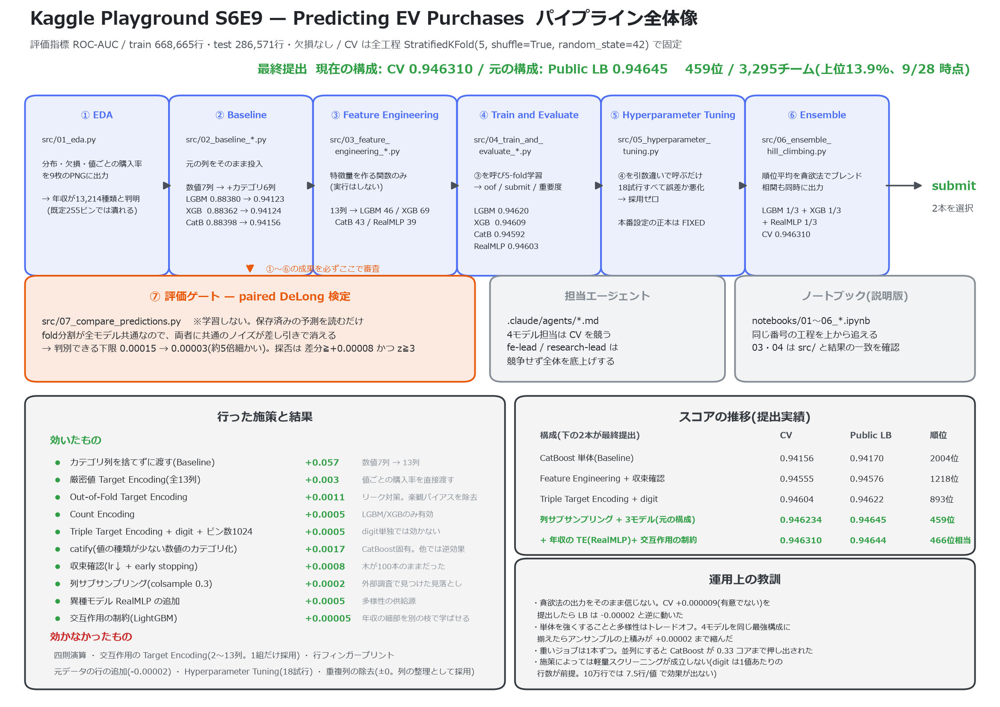

# Kaggle Playground Series S6E9 — Predicting Electric Vehicle Purchases

## コンペ概要

EV(電気自動車)を購入するか(`Will_Buy_EV`: Yes/No)を予測する二値分類コンペ。
評価指標は **ROC-AUC(0~1)**。 ※ 1 に近いほど精度がよく、順位が高い。

- コンペ: https://www.kaggle.com/competitions/playground-series-s6e9(締切 2026-09-30)
- データ: 顧客の属性・通勤距離・充電環境・補助金の有無など 13 列。train 668,665 行 / test 286,571 行

## 結果

最終提出の 2 本(2026-09-28 時点。**Public LB は test の 20% だけで採点**され、最終順位は残り 80% の Private LB で決まる)。

| 最終提出 | CV | Public LB | 順位(Public) | 上位 |
|---|---|---|---|---|
| 元の構成 | 0.946234 | **0.94645** | **459位 / 3,295チーム** | **13.9%** |
| 現在の構成(CV 最高) | **0.946264** | 0.94642 | 537〜553位相当 | 16.3〜16.8% |

- Public LB の順位は、これまでの全提出のうち Public が最も良いもの(元の構成)で付く。「現在の構成」の順位は、同じ LB に照らした相当位置
- 締切後の最終順位(Private LB)は、最終提出に選んだ 2 本のうち良い方で付く
- 参加チームが増え続けるため、**スコアが同じでも順位は日々下がる**
  (320位 / 2,732チーム(09-23)→ 459位 / 3,295チーム(09-28))

## プロセス全体像



```
① EDA → ② Baseline → ③ Feature Engineering → ④ Train and Evaluate → ⑥ Ensemble → submit
                        (関数の定義)            (学習・OOF の保存)  ↑        (oof/ を読む)
                                                      │ 引数を変えて呼ぶ
                                            ⑤ Hyperparameter Tuning
                          ⑦ Paired DeLong Test … ③〜⑥ の変更を採用するかを判定
```

### ディレクトリ構成

【ignore】は `.gitignore` の対象(リポジトリに含めない)。データと実行成果物は再現できるため、記録類はローカルで管理するため除外している。
詳細な実験ログ(`Log.md`)や外部調査の記録も、ローカルだけで管理している。

```
kaggle/                                  # リポジトリのルート(コンペごとのフォルダ)
└── 2609/                                # このコンペ
    ├── README.md
    ├── CLAUDE.md                        # Claude Code への方針・規約
    ├── pyproject.toml / uv.lock / .python-version   # 環境(ライブラリの版を固定)
    ├── src/                             # 本番パイプライン
    │   ├── 01_eda.py
    │   ├── 02_baseline_<model>.py
    │   ├── 03_feature_engineering_<model>.py   # 本番で使う特徴量の関数
    │   ├── 03_feature_engineering_all.py       # 横断カタログ + 不採用の関数の記録
    │   ├── 04_train_and_evaluate_<model>.py
    │   ├── 05_hyperparameter_tuning.py
    │   ├── 06_ensemble_hill_climbing.py
    │   ├── 07_compare_predictions.py
    │   └── feature_catalog.py                  # 採否表(FUNC_STATUS)と列名の JSON 出力
    ├── notebooks/                       # 工程を追える説明版(01〜06)
    ├── docs/
    │   ├── pipeline_overview.png        # プロセス全体像の図
    │   ├── eda_results.md               # EDA の結果
    │   ├── fe_results_<model>.md / fe_results_all.md   # 各担当の検証記録
    │   ├── features_<model>.json        # 本番で使っている列名(--dump-features で生成)
    │   ├── hyperparameter_tuning_results.csv   # ⑤ の試行ごとの記録(05 が書き、05 の --report が読む)
    │   └── reference_URL.md 【ignore】   # 参考カーネルの調査結果
    ├── .claude/agents/                  # サブエージェントの定義
    │   └── lookup-transformer-lead.md 【ignore】
    ├── data/ 【ignore】                  # train.csv / test.csv / sample_submission.csv / 元データ
    ├── datacheck/ 【ignore】             # EDA の図
    ├── oof/ 【ignore】                   # oof_<model>.npy / pred_<model>.npy(アンサンブル用)
    ├── submit/ 【ignore】                # submission_<model>.csv
    ├── importance/ 【ignore】            # feature importance の棒グラフ
    ├── experiments_rejected/ 【ignore】  # 不採用の実験成果物(記録として保持)
    ├── backup_*/ 【ignore】              # バックアップ
    ├── catboost_info/ 【ignore】         # CatBoost が学習時に書き出すログ
    ├── kernels/ 【ignore】               # 取得した公開カーネル
    ├── kaggle_kernel_*/ 【ignore】       # Kaggle Notebook で動かしたモデル
    ├── tools/ 【ignore】                 # 図の作成などの補助スクリプト
    ├── .venv/ 【ignore】                 # uv が作る仮想環境
    └── Log.md / nippo.md / research.md / prompt.md / main.py / fe_results_lookup.md 【ignore】   # 実験ログなどの記録
```

---

## 【ソースコード】

**ファイル名の先頭の番号が工程の順番**。`src/` が本番、`notebooks/` は同じ番号の工程を上から追える説明版
(03・04 は `src/` と結果が一致することをノートブックの中で確認している)。

| # | 工程 | 本番(`src/`) | 説明版(`notebooks/`) | 出力 |
|---|---|---|---|---|
| ① | EDA(探索的データ分析) | `01_eda.py` | `01_eda.ipynb` | `datacheck/*.png` |
| ② | Baseline(ベースライン) | `02_baseline_<model>.py` | `02_baseline.ipynb` | `submit/submission_baseline_<model>.csv` |
| ③ | Feature Engineering(特徴量エンジニアリング) | `03_feature_engineering_<model>.py` | `03_feature_engineering.ipynb` | (関数のみ。実行しない) |
| ④ | Train and Evaluate(学習と評価) | `04_train_and_evaluate_<model>.py` | `04_train_and_evaluate.ipynb` | `oof/` `submit/` `importance/` |
| ⑤ | Hyperparameter Tuning(ハイパーパラメータ調整) | `05_hyperparameter_tuning.py` | `05_hyperparameter_tuning.ipynb` | `docs/hyperparameter_tuning_results.csv` |
| ⑥ | Ensemble(アンサンブル) | `06_ensemble_hill_climbing.py` | `06_ensemble.ipynb` | `submit/submission_hillclimb.csv` |
| ⑦ | Paired DeLong Test(対応のある DeLong 検定) | `07_compare_predictions.py` | (`06_ensemble.ipynb` に含む) | 採否判定 |
| — | 補助 | `feature_catalog.py` | — | 本番で使っている関数の一覧(`FUNC_STATUS`)と列名の JSON 出力 |
| — | Claude Code | `.claude/agents/*.md` | — | `docs/fe_results_*.md` |

| モデル | ② Baseline | ④ 最終構成 | 列数 |
|---|---|---|---|
| LightGBM | 0.94123 | **0.94611** | 46 |
| XGBoost | 0.94124 | **0.94609** | 69 |
| CatBoost | 0.94156 | 0.94592 | 43(アンサンブルの重みは 0) |
| RealMLP | — | 0.94603 | 39 |
| **アンサンブル**(LightGBM・XGBoost・RealMLP の順位平均) | — | **0.946264** | — |

> **GBDT**(Gradient Boosting Decision Tree:勾配ブースティング決定木)は、決定木を少しずつ足して誤りを補正していくモデルの総称。このリポジトリでは **LightGBM・XGBoost・CatBoost の3つのモデル**を指す。

## Notebooks

工程を上から読んで追えるようにしたもの。リポジトリのルートから起動しても、`notebooks/` から
起動しても動く(先頭セルで作業ディレクトリを揃えている)。

`src/` と同じ番号体系。

| Notebook | 対応する工程 | 内容 |
|---|---|---|
| `notebooks/01_eda.ipynb` | ① | データの素性、値の種類（ユニーク値）の数、値ごとの購入率 |
| `notebooks/02_baseline.ipynb` | ② | 3モデルのベースライン(共通の CV ループ) |
| `notebooks/03_feature_engineering.ipynb` | ③ | read_csv から特徴量の作成までを **GBDT 共通 → GBDT モデル別 → RealMLP** の順にノートブック内で実行し、意図と根拠を説明。本番の .py と値まで一致することも確認。不採用にした施策の一覧も載せる |
| `notebooks/04_train_and_evaluate.ipynb` | ④ | 4モデルを本番と同じ特徴量・設定で上から順に学習し、本番の OOF と一致することを確認(約75分) |
| `notebooks/05_hyperparameter_tuning.ipynb` | ⑤ | Hyperparameter Tuning の設計と所要時間の見積もり + 実行した 18 試行の結果(すべて誤差か悪化。計画 24 のうち 6 本は打ち切り) |
| `notebooks/06_ensemble.ipynb` | ⑥⑦ | ブレンドの再現。相関の確認と DeLong 検定による採否判定まで |

Jupyter で開く際は、カーネルに **`.venv` の Python** を選ぶこと。

**ノートブックは `src/` を読み込んで動く。クローン・持ち出しの際は `src/` も必ず含めること。**
04・06 などは特徴量を作る関数やモデル本体を `src/` から import しており、`notebooks/` だけでは動かない。
関数をノートブックへ移さない理由は `notebooks/04_train_and_evaluate.ipynb` の冒頭に記載している
(要点: 本番の正本を1か所に保つため。Target Encoding は fold ごとに作り直すので、列名だけ渡しても `src/` の関数は必要になる)。

## ① EDA(Exploratory Data Analysis:探索的データ分析)

モデルを作る前にデータの分布・欠損・目的変数との関係を調べ、どんな特徴量が効きそうかの仮説を立てる工程。

```bash
uv run src/01_eda.py
```

`data/` の CSV を読み込み、特徴量をグラフ化して `datacheck/` に保存する(ファイル名先頭の連番が表示順)。

| ファイル | 内容 |
|---|---|
| `01_target_distribution.png` | 目的変数の件数と比率 |
| `02_categorical_hist.png` | カテゴリ6列の分布(Yes/No積み上げ) |
| `03_numeric_hist.png` | 数値7列の分布 |
| `04_numeric_log_hist.png` | 値の種類（ユニーク値）が多い2列の対数分布 |
| `05_correlation_heatmap.png` | 数値列と目的変数の相関 |
| `06_boxplots_by_target.png` | Yes/No別の箱ひげ図 |
| `07_target_rate_by_category.png` | カテゴリ値ごとの購入率 |
| `08_target_rate_by_numeric.png` | 数値の値ごとの購入率 |
| `09_train_test_distribution.png` | train と test の分布比較 |

**主な情報**: train 668,665行 / test 286,571行、欠損なし、購入率 17.5%。
`Environmental_Concern_Level` の効きが圧倒的(レベル1で約1% → レベル5で約52%)。
**年収は 13,214 種類の値**を持ち、木の既定ビン数(255)では値ごとの違いが潰れる
→ 後の厳密値 Target Encoding とビン数引き上げにつながる最重要の所見。

## ② Baseline(ベースライン:基準となるモデル)

特徴量を作らず元の列だけで学習し、以降の改善を測る基準のスコアを作る工程。CV の分け方もここで全モデル共通に固定する。

```bash
uv run src/02_baseline_lgbm.py
uv run src/02_baseline_xgb.py
uv run src/02_baseline_catboost.py
```

**数値列のみ(7列)** と、**数値列 + カテゴリ列(13列)** の2通りで学習する
(カテゴリ列はエンコードせず、各ライブラリのネイティブなカテゴリ対応に渡す)。
CV は全モデル共通で `StratifiedKFold(n_splits=5, shuffle=True, random_state=42)`。
**この分割を全モデルで揃えることが、後のアンサンブルと DeLong 検定の前提になる。**

| モデル | OOF AUC<br>数値列のみ(7列) | OOF AUC<br>数値列 + カテゴリ列(13列) | Public LB<br>(13列) | 順位(このスコアなら現時点で) |
|---|---|---|---|---|
| LightGBM | 0.88380 | 0.94123 | 0.94093 | 2743位(上位83.2%) |
| XGBoost | 0.88362 | 0.94124 | 0.94152 | 2277位(上位69.1%) |
| CatBoost | 0.88398 | 0.94156 | 0.94170 | 2004位(上位60.8%) |

**カテゴリ列を加えるだけで、3モデルとも約 +0.057。** `Subsidy_Available` と `Range_Anxiety_Level` は
数値列より購入率の差がはるかに大きく、落とすとこの情報をまるごと失う。以降は13列を出発点にする。

> 順位は **2026-09-28 時点**(3,295チーム)の Public LB で、そのスコアが何位に相当するかを
> 示したもの。提出当時の順位ではない。

## ③ Feature Engineering(特徴量エンジニアリング)

元の列から、モデルが学びやすい形の新しい列(特徴量)を作る工程。ここでは作り方を関数として定義するだけで、実行はしない。

> **RealMLP について**: RealMLP は数値を埋め込みに変えて学ぶニューラルネットワーク。GBDT と予測の間違え方が違うため、アンサンブルの多様性を補う目的で③から導入。前処理と設定が複雑で、ベースラインには含めない。

| モデル | ③ Feature Engineering の関数 |
|---|---|
| LightGBM | `src/03_feature_engineering_lgbm.py` |
| XGBoost | `src/03_feature_engineering_xgb.py` |
| CatBoost | `src/03_feature_engineering_catboost.py` |
| RealMLP | `src/03_feature_engineering_realmlp.py` |
| (横断) | `src/03_feature_engineering_all.py`(全モデルの Feature Engineering を集約したカタログ。不採用の関数の記録もここ) |

**効いたもの**
- **厳密値 Target Encoding**(各モデル +0.003 前後、最大の改善要因)。数値列もビン分割せず値のままキーにする
- **Out-of-Fold Target Encoding によるリーク対策**(+0.00108)。学習行には内側CVのOOF値を当てる
- Count Encoding(LightGBM/XGBoost のみ。CatBoost では無効)
- Triple Target Encoding(平滑化3種)+ Smooth Keys + digit features + ビン数1024(+0.0005〜0.001)
- catify(値の種類（ユニーク値）が少ない数値のカテゴリ化)は **CatBoost 固有**(+0.0017)
- 列の整理(±0。スコアは変わらないが列が減り、読みやすくなる): 他の列と同じ情報しか持たない列を作らない(GBDT 3種)、値の種類が少ない数値列のエンコーディングを Target Encoding だけに絞る(LightGBM・CatBoost)。どの列を作るかは各モデルの `te_plan()` にまとめてある
- 交互作用 1 組「自宅充電の可否 × 自宅スタンド数」(LightGBM・RealMLP。+0.00001 で有意差はないが、CV 最高のため最終構成 D に採用)
- RealMLP の年収の Target Encoding(train だけで作る。`--te-income`)。元データの購入率と並べて単体 +0.000128 / アンサンブル +0.000018

**効かなかったもの**: 四則演算、交互作用の Target Encoding(2〜13列。上の1組を除く)、行フィンガープリント、元データの行の追加、補助金との組み合わせ。
各施策の詳細(なぜ試したか / 期待した効果 / 結果の考察)は `docs/fe_results_*.md` を参照。

> `src/03_feature_engineering_<model>.py` は**関数の定義のみ**、`src/04_train_and_evaluate_<model>.py` が**実行**という分担。
> この分離により、同じ関数を別の検証スクリプトからも再利用できる。

## ④ Train and Evaluate(学習と評価)

③の関数で特徴量を作り、交差検証(CV)でモデルを学習・評価して、予測と提出ファイルを保存する工程。

| モデル | ④ 学習・評価の実行スクリプト |
|---|---|
| LightGBM | `src/04_train_and_evaluate_lgbm.py` |
| XGBoost | `src/04_train_and_evaluate_xgb.py` |
| CatBoost | `src/04_train_and_evaluate_catboost.py` |
| RealMLP | `src/04_train_and_evaluate_realmlp.py` |

### 現行ベストの再現コマンド

```bash
uv run src/04_train_and_evaluate_lgbm.py \
  --max_bin 1024 --feature_fraction 0.3 --max_depth 5 \
  --folds 5 --learning_rate 0.03 --n_estimators 8000 --early_stopping 200 --n_jobs 7 --save --tag lgbm

uv run src/04_train_and_evaluate_xgb.py --max-bin 1024 \
  --set-param colsample_bytree=0.3 --set-param max_depth=5 \
  --folds 5 --learning-rate 0.03 --n-estimators 8000 --early-stopping 200 --n-jobs 7 --save --out-suffix ""

uv run src/04_train_and_evaluate_catboost.py \
  --folds 5 --iters 1000 --lr 0.06 --fast --border 64 --hc-border 1024 --threads 7 --save

uv run src/04_train_and_evaluate_realmlp.py --folds 5 --threads 7 --combo-home --te-income --tag realmlp   # epochs は 2 から変えないこと
```

| モデル | OOF AUC | 備考 |
|---|---|---|
| **LightGBM** | **0.94610** | アンサンブル採用 |
| **XGBoost** | **0.94609** | アンサンブル採用 |
| **RealMLP** | **0.94603** | アンサンブル採用。GBDTとの相関が低く多様性を供給 |
| CatBoost | 0.94592 | 現在アンサンブルの重みは 0 |

> **重いジョブは1つずつ実行すること**(8コア環境)。CatBoost と RealMLP を並列で走らせると
> CPU を取り合って完走しない(実際に CatBoost が 0.33 コアまで押し出された)。

### 使っている特徴量の列名を確認する

`--dump-features` を付けると、**fold 1 の学習行列を組み上げた直後に列名を `docs/features_<tag>.json` へ書いて終了する**(学習しない)。本番と同じコードパスを通るので列の取りこぼしがない。`notebooks/03_feature_engineering.ipynb` は、ノートブックで組み上げた列がこの JSON と一致するかを確かめる。

```bash
uv run src/04_train_and_evaluate_lgbm.py --dump-features --tag lgbm
uv run src/04_train_and_evaluate_xgb.py --dump-features --out-suffix ""
uv run src/04_train_and_evaluate_catboost.py --fast --dump-features --tag catboost
uv run src/04_train_and_evaluate_realmlp.py --combo-home --te-income --dump-features --tag realmlp
```

**Feature Engineering を変えたら再生成すること。** JSON は生成物だが `data/` を含めていないためクローン先では作り直せない。ノートブックの表示元になるのでリポジトリに含めている。

## ⑤ Hyperparameter Tuning(ハイパーパラメータ調整)

学習率や木の深さなど、学習前に決めておく設定値(ハイパーパラメータ)を変えて、より良い組み合わせを探す工程。

**列サブサンプリングの見落としが最大の伸びしろだった**(2026-09-20、外部カーネル調査で発見)。
92列の Target Encoding 特徴量に対し全列を使うと、どの木も最強列(年収の Target Encoding)を根に選ぶため木が似通う。

| モデル | 設定 | 効果 |
|---|---|---|
| LightGBM | `feature_fraction=0.3, max_depth=5` | **+0.000223**(z=+10.4) |
| XGBoost | `colsample_bytree=0.3, max_depth=5` | **+0.000163**(z=+8.5) |
| CatBoost | — | 列サンプリングは**有害**(-0.00015)。対称木のため木全体が一斉に弱くなる |

**木を弱くしたら `n_estimators` を増やして収束を取り直すこと。** 怠ると「効かない」と誤判定する。

### 探索のフレーム

```bash
uv run src/05_hyperparameter_tuning.py lgbm --estimate          # 試行一覧と所要時間の見積もりだけ表示
uv run src/05_hyperparameter_tuning.py lgbm                     # 実行(1本ずつ順番に)
uv run src/05_hyperparameter_tuning.py lgbm --only num_leaves   # 特定の軸だけ
uv run src/05_hyperparameter_tuning.py --report                 # これまでの結果を表示
```

`src/05_hyperparameter_tuning.py` は**学習コードを持たない**。既存の `04_train_and_evaluate_<model>.py` を引数違いで
呼ぶだけにして、収束設定や Feature Engineering の構成が本番とズレないようにしている。解説は
`notebooks/05_hyperparameter_tuning.ipynb`。

**本番のパラメータの正本は `src/05_hyperparameter_tuning.py` の `FIXED`**(本番コマンドのうち探索しない固定部分)。
05 の結果が 04 に自動で反映される仕組みはなく、`notebooks/04_train_and_evaluate.ipynb` は確定した値を書き写したうえで、
6 章で `FIXED` と同じかを照合している(ずれていれば止まる)。④の再現コマンドも `FIXED` と同じ値にそろえること。

| モデル | 試行数 | 1本あたり | 合計 | 優先度 |
|---|---|---|---|---|
| LightGBM | 9 | 約 4.2 分 | **約 0.6 時間** | **高**(`num_leaves` がデフォルト31のまま未調整) |
| XGBoost | 10 | 約 10.8 分 | 約 1.8 時間 | 中 |
| CatBoost | 5 | 約 25 分 | 約 2.1 時間 | 低(現在アンサンブルの重みが 0) |

> **期待値は低い。** 外部調査では、列サブサンプリング導入後にさらに深さや列比率を振った試行は
> すべて -0.000023〜+0.000017 の誤差だった。未調整の `num_leaves` だけが本命。

## ⑥ Ensemble(アンサンブル)

複数のモデルの予測を組み合わせ、1つのモデルより安定して高いスコアを出す工程。どのモデルをどの比率で混ぜるかを決める。

```bash
uv run src/06_ensemble_hill_climbing.py
```

`oof/oof_<name>.npy` と `oof/pred_<name>.npy` の組をすべて候補として読み込み、rank 正規化した予測を
hill climbing で足し合わせる。選ばれた回数がそのまま重みになる。

**採用モデル間の順位相関**も併せて出力する。相関が高いほど同質で、足しても伸びない
(弱くても非相関なら勝てる)。未採用の候補のうち最も非相関なものも提示するので、
多様性が枯渇したときにどれを足せばよいかが分かる。

**最終提出(2本)**: どちらも LightGBM 1/3 / XGBoost 1/3 / RealMLP 1/3 の順位平均

| 提出 | CV | Public LB |
|---|---|---|
| **現在の構成**(D + RealMLP に年収の Target Encoding を train だけで追加。2026-09-28) | **0.946264** | 0.94642 |
| (参考)D(置き換え前。LightGBM・RealMLP に自宅充電 × 自宅スタンド数を追加。タグ `best-20260927-d`) | 0.946245 | 0.94640 |
| 元の構成(タグ `final-original-20260927`) | 0.946234 | **0.94645** |
(**459位 / 3,295チーム**、2026-09-28 時点。上の「結果」を参照)

> ⚠ **hill climbing の出力をそのまま信じないこと。** 貪欲法は OOF 上の偶然を拾う。
> CV +0.000009(z=+1.57、有意でない)の構成を提出したところ、LB では -0.00002 と逆に動いた。
> **必ず ⑦ の DeLong 検定で有意性を確認してから提出する。**

> `06_ensemble_hill_climbing.py` は実行のたびに `submit/submission_hillclimb.csv` を上書きする。
> 不採用の実験結果は `experiments_rejected/` に退避して候補から外すこと。

### 提出

```bash
kaggle competitions submit -c playground-series-s6e9 -f submit/submission_hillclimb.csv -m "<説明>"
```

## ⑦ Paired DeLong Test(対応のある DeLong 検定)

2つの予測の AUC の差が偶然か本物かを統計的に判定し、変更を採用するかを決める工程。学習はせず、保存済みの予測を読むだけ。

```bash
uv run src/07_compare_predictions.py lgbm lgbm_shallow      # 2つを比較
uv run src/07_compare_predictions.py --all realmlp          # 全候補と比較
```

全モデルが fold 分割を `random_state=42` で固定して
いるため、2つの予測は**同じ行・同じ分割**で作られている。DeLong 検定はこの対応を使って差の標準誤差を
直接求めるので、**両者に共通のノイズが差し引きで消え**、AUC を別々に眺めるより桁違いに細かく差を
見分けられる。

| | 従来 | DeLong |
|---|---|---|
| ノイズ床(SE) | 0.00015 | **0.00003 前後** |
| 採否基準 | 差分 ≥ +0.0002 | 差分 ≥ +0.00008 **かつ** z ≥ 3 |

導入の効果は早速出た。XGBoost の列サブサンプリング(+0.000163)は**従来基準なら捨てていた**数字だが、
z=+8.48 で誤差でないことが確定した。

---

## 提出ごとの推移

| 提出 | CV | Public LB | 順位(現時点のLBでの相当位置) |
|---|---|---|---|
| CatBoost 単体(ベースライン) | 0.94156 | 0.94170 | 2004位(上位60.8%) |
| Feature Engineering + 収束確認 | 0.94555 | 0.94576 | 1218位(上位37.0%) |
| Triple Target Encoding + digit | 0.94604 | 0.94622 | 893位(上位27.1%) |
| **列サブサンプリング + 3モデル(元の構成。最終提出)** | **0.946234** | **0.94645** | **432位(上位13.1%)** |
| **現在の構成(列の整理 + 交互作用 + RealMLP の年収 Target Encoding。最終提出)** | **0.946264** | 0.94642 | 537位(上位16.3%) |

> 順位はいずれも **2026-09-28 時点**(3,295チーム)の Public LB に照らした相当位置(そのスコアより上のチーム数 + 1)で、
> 提出当時の順位ではない。
> **実際の順位は 459位。** 0.94645 は 34チームが並ぶ同点帯(432〜465位)で、
> Kaggle は同点を提出時刻の早い順に並べるため、スコア相当位置より後ろになる。
> 参加チームは増え続けるため、同じスコアでも順位は日々下がっていく(09-23 時点では 320位 / 2,732チーム)。

## この取り組みで効いたこと

1. **厳密値 Target Encoding**(+0.003)— 前コンペの教訓がそのまま再現した最大の要因
2. **収束の確認**(+0.0008)— Feature Engineering で特徴量を13→39列に増やしたのに木の本数がデフォルト100のままだった
3. **列サブサンプリング**(+0.0002)— 外部調査で見つけた見落とし。引数を足すだけ
4. **異種モデル(RealMLP)の追加** — GBDT同士は相関0.99で同質化しており、多様性の供給源になった
5. **paired DeLong 検定** — 従来なら誤差として捨てていた改善を拾えるようになった

**効かなかったこと**: 四則演算・交互作用など「人間が意味を考えて作った特徴量」は全滅だった。
合成データの生成過程にそうした関係がなかったため。
## Claude Code の構成

Claude Code のサブエージェント(役割ごとに指示を分けた AI の担当者)を置き、モデルごとに改善を競わせ、支援役が横展開と情報収集を担う。

定義は `.claude/agents/`、AI による設計・検証の方針は [CLAUDE.md](CLAUDE.md) にまとめている。

| エージェント | 役割 | 記録 |
|---|---|---|
| `lgbm-lead` / `xgb-lead` / `catboost-lead` / `realmlp-lead` | 各モデルの CV AUC 向上を**競う** | `docs/fe_results_*.md` |
| `fe-lead` | Feature Engineering の統括。**競争せず**、モデル間の取りこぼしを横展開する | `docs/fe_results_all.md` |
| `research-lead` | 情報収集。**競争せず**、Kaggle の Code / Discussion から新しい手を持ち込む | (ローカル管理) |

- モデル担当の審査は単体 AUC だけでなく、**他モデルとの非相関性**(アンサンブルへの貢献度)も見る
- 支援役(`fe-lead` / `research-lead`)の評価は「他モデルがどれだけ伸びたか」
- 他モデルのファイルは編集しない。Kaggle への提出は指揮官(ユーザー)の承認後のみ

## 環境

- Python 3.14 / uv で管理(導入は下の「セットアップ」)
- 主要ライブラリ: lightgbm, xgboost, catboost, torch(CPU版), scikit-learn, pandas, matplotlib, seaborn
- GPU は無し。RealMLP は CPU 学習で 1エポック約290秒(7スレッド)

## セットアップ(クローンから再現まで)

動作確認環境: Windows 11 / CPU 8 コア / GPU なし。Python 3.14 と各ライブラリの版は `uv.lock` で固定している。

```bash
git clone https://github.com/takactkc123-create/kaggle.git
cd kaggle/2609
uv sync

# データの取得(Kaggle API の認証ファイル kaggle.json と、コンペの参加規約への同意が必要)
uv run kaggle competitions download -c playground-series-s6e9 -p data --unzip
uv run kaggle datasets download -d itzzomkar/ev-adoption-behavior-and-range-anxiety -p data --unzip
```

- 2 つ目は**元データ**(`data/EV_Adoption_and_Range_Anxiety_Dataset.csv`、1 万行)。コンペのデータはこれを元に Kaggle が生成したもので、
  コンペの Data ページで使用が認められている(CC0)。
- 元データは学習には使わない。RealMLP の特徴量 1 列(年収ごとの元データでの購入率)を作るためだけに使う。
  **ないとエラーにならずにこの列が抜け(39 列 → 38 列)、スコアが本番と一致しない**ので、必ず取得すること。
- 取得後は「[現行ベストの再現コマンド](#現行ベストの再現コマンド)」で 4 モデルを学習(約 75 分)→ `uv run src/06_ensemble_hill_climbing.py` でアンサンブル。
- ノートブックは、カーネルに `.venv` の Python を選べば動く。
